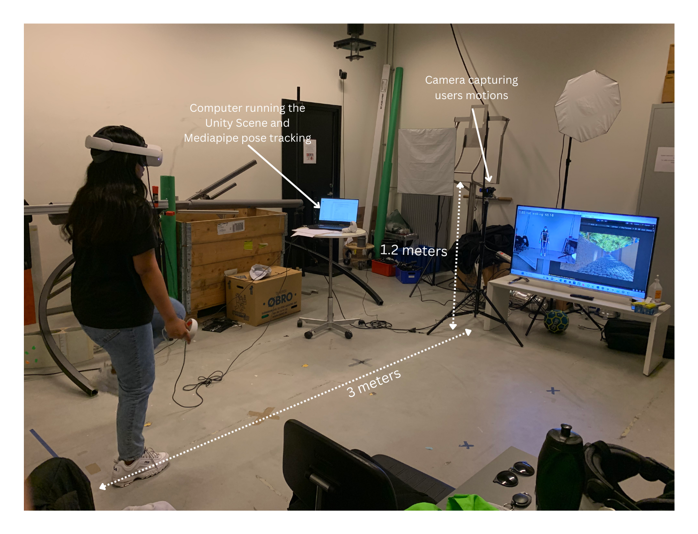
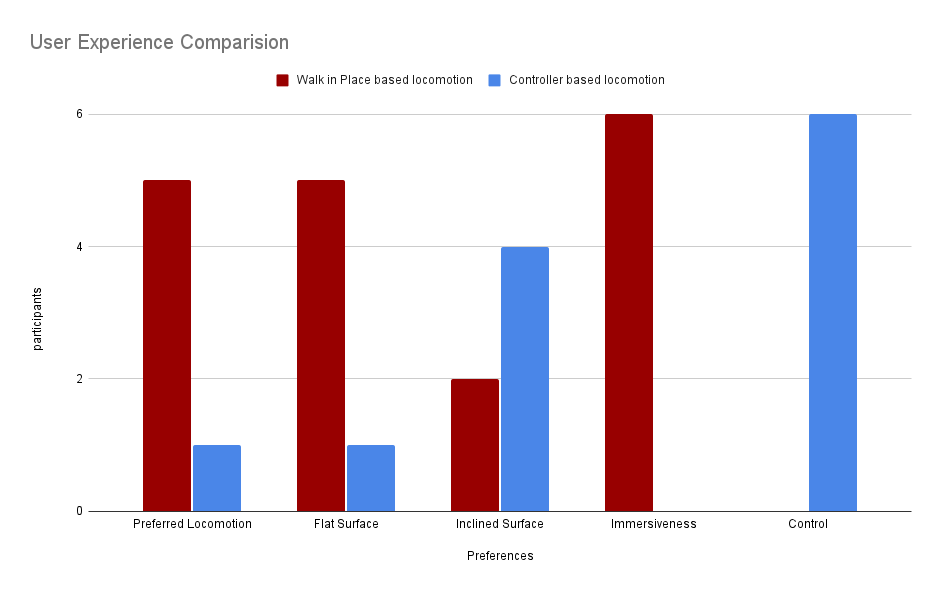
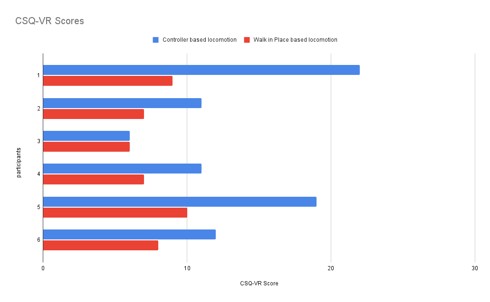
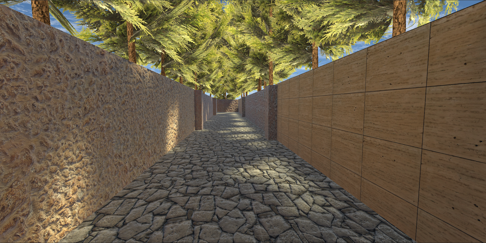
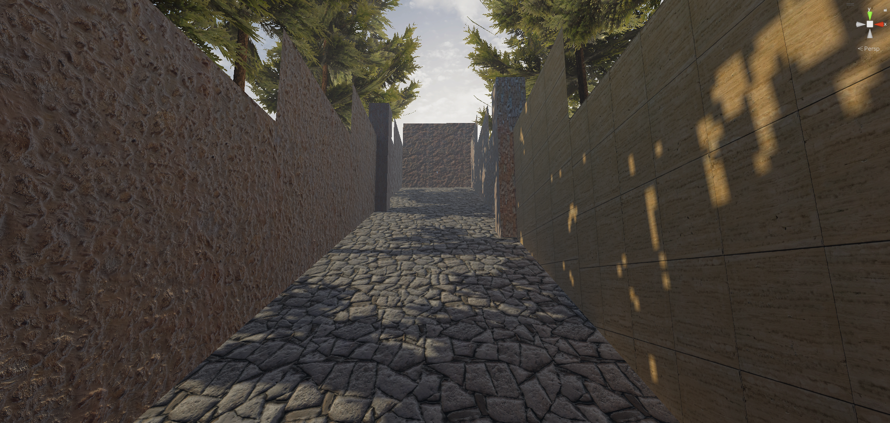

# WiP-Based-VR-Locomotion
    *Walk in Place (WiP) Locomotion: Offers a natural VR movement experience by simulating walking while stationary.This addresses issues like cybersickness and awkward motion caused by current locomotion methods.
    *Development Tools: Created using Unity and Meta Quest 2 hardware.
    *Mediapipe Pose Estimation: Identifies leg joint movements for accurate tracking of walking motion.
    *LSTM Integration: Detects walking motion.
    *Unity Scene: A VR scene where a force is applied on the user to move when signaled by the LSTM module.
    *Testing: Evaluated on both flat and inclined surfaces for usability and cybersickness.

    Refer to the report for more details

    
   *User Testing:
   
   

   
   *Testing Results:
   
   
   

   
   *Unity Scenes:
   
   
   
